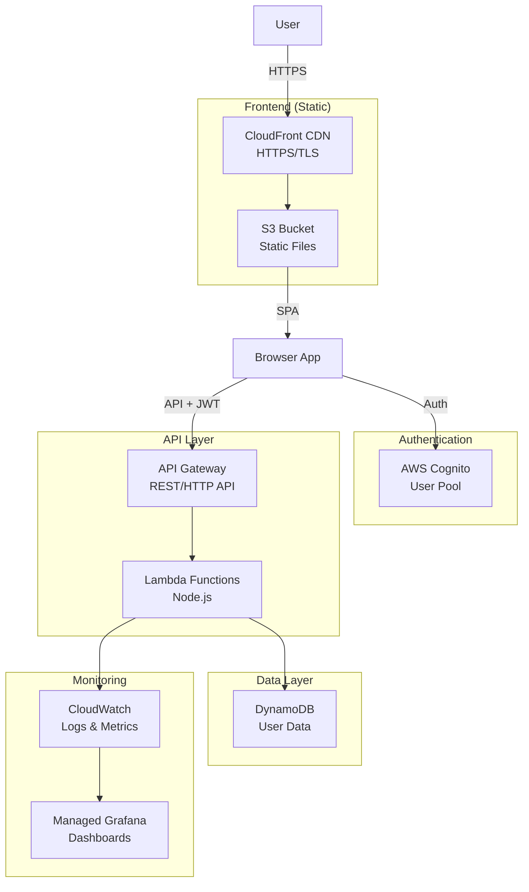

# Serverless Multi-Tenant Application - Learning Project

## Project Overview
Build a serverless web application where users can sign up, log in, and access their own personalized dashboard. This project focuses on learning AWS serverless architecture, authentication, monitoring, and modern CI/CD practices.

## Learning Objectives
- Understand serverless architecture patterns
- Implement secure authentication with AWS Cognito
- Build and deploy Lambda functions
- Set up monitoring and observability
- Create CI/CD pipelines with GitHub Actions
- Practice Infrastructure as Code (IaC)
- Implement local development workflows

---

## Architecture Diagram



---

## Learning Phases

### Phase 0: Foundation & Setup (Week 1)
**Goal**: Understand the project structure and set up development environment

#### What You'll Learn:
- AWS account setup and IAM basics
- Node.js project structure
- Git and GitHub setup
- Basic AWS CLI usage

#### Tasks:
1. **Set up AWS account**
   - Create free tier account
   - Set up IAM user with programmatic access
   - Configure AWS CLI locally
   
2. **Initialize project structure**
   ```
   serverless-app/
   ├── backend/           # Lambda functions
   │   ├── src/
   │   ├── tests/
   │   └── package.json
   ├── frontend/          # Static SPA
   │   ├── index.html
   │   ├── app.js
   │   └── style.css
   ├── infrastructure/    # IaC (CDK or SAM)
   │   └── template.yaml
   ├── .github/
   │   └── workflows/
   └── README.md
   ```

3. **Local development tools**
   - Install Node.js 18+
   - Install AWS SAM CLI
   - Install Docker (for local DynamoDB)
   - Set up VS Code with AWS Toolkit

#### Key Concepts to Master:
- What is serverless computing?
- AWS regions and availability zones
- IAM roles vs users
- Environment variables and secrets

---

### Phase 1: Build Simple Backend (Week 2)
**Goal**: Create your first Lambda function and understand event-driven architecture

#### What You'll Learn:
- Lambda function anatomy
- API Gateway integration
- Local Lambda development
- Unit testing serverless functions

#### Implementation Steps:

1. **Create your first Lambda**
   ```javascript
   // backend/src/handlers/hello.js
   exports.handler = async (event) => {
       console.log('Event:', JSON.stringify(event, null, 2));
       
       return {
           statusCode: 200,
           headers: {
               'Content-Type': 'application/json',
               'Access-Control-Allow-Origin': '*'
           },
           body: JSON.stringify({
               message: 'Hello from Lambda!',
               timestamp: new Date().toISOString()
           })
       };
   };
   ```

2. **Test locally with SAM**
   ```bash
   # Create event.json
   sam local invoke HelloFunction --event event.json
   
   # Start local API
   sam local start-api
   ```

3. **Write unit tests**
   ```javascript
   // backend/tests/hello.test.js
   const { handler } = require('../src/handlers/hello');
   
   test('returns successful response', async () => {
       const event = {};
       const response = await handler(event);
       expect(response.statusCode).toBe(200);
   });
   ```

#### Exercises:
- Modify the Lambda to accept query parameters
- Add error handling for invalid inputs
- Create a second endpoint that returns user info

---

### Phase 2: Add Authentication (Week 3)
**Goal**: Implement secure user authentication with Cognito

#### What You'll Learn:
- Cognito User Pools vs Identity Pools
- JWT tokens and validation
- Secure password handling
- MFA options

#### Implementation Steps:

1. **Set up Cognito User Pool**
   ```yaml
   # infrastructure/template.yaml (SAM)
   UserPool:
     Type: AWS::Cognito::UserPool
     Properties:
       UserPoolName: serverless-app-users
       Schema:
         - Name: email
           Required: true
           Mutable: false
       AutoVerifiedAttributes:
         - email
       Policies:
         PasswordPolicy:
           MinimumLength: 8
           RequireUppercase: true
           RequireLowercase: true
           RequireNumbers: true
   ```

2. **Create auth middleware**
   ```javascript
   // backend/src/middleware/auth.js
   const { CognitoJwtVerifier } = require("aws-jwt-verify");
   
   const verifier = CognitoJwtVerifier.create({
       userPoolId: process.env.USER_POOL_ID,
       tokenUse: "id",
       clientId: process.env.CLIENT_ID
   });
   
   exports.authenticate = async (token) => {
       try {
           const payload = await verifier.verify(token);
           return { success: true, user: payload };
       } catch (error) {
           return { success: false, error: error.message };
       }
   };
   ```

3. **Protected endpoint**
   ```javascript
   // backend/src/handlers/profile.js
   const { authenticate } = require('../middleware/auth');
   
   exports.handler = async (event) => {
       const token = event.headers.Authorization?.replace('Bearer ', '');
       
       const auth = await authenticate(token);
       if (!auth.success) {
           return {
               statusCode: 401,
               body: JSON.stringify({ error: 'Unauthorized' })
           };
       }
       
       return {
           statusCode: 200,
           body: JSON.stringify({
               userId: auth.user.sub,
               email: auth.user.email
           })
       };
   };
   ```

#### Exercises:
- Implement user registration endpoint
- Add password reset functionality
- Enable MFA for enhanced security

---

### Phase 3: Database Integration (Week 4)
**Goal**: Store and retrieve user data with DynamoDB

#### What You'll Learn:
- NoSQL concepts and DynamoDB
- Single table design patterns
- Local DynamoDB for development
- Query optimization

#### Implementation Steps:

1. **Define DynamoDB table**
   ```yaml
   # infrastructure/template.yaml
   UserTable:
     Type: AWS::DynamoDB::Table
     Properties:
       TableName: serverless-users
       AttributeDefinitions:
         - AttributeName: userId
           AttributeType: S
         - AttributeName: createdAt
           AttributeType: N
       KeySchema:
         - AttributeName: userId
           KeyType: HASH
         - AttributeName: createdAt
           KeyType: RANGE
       BillingMode: PAY_PER_REQUEST
   ```

2. **Create data access layer**
   ```javascript
   // backend/src/data/userRepository.js
   const AWS = require('aws-sdk');
   const dynamodb = new AWS.DynamoDB.DocumentClient({
       region: process.env.AWS_REGION,
       ...(process.env.IS_LOCAL && {
           endpoint: 'http://localhost:8000'
       })
   });
   
   exports.createUser = async (userId, userData) => {
       const params = {
           TableName: process.env.TABLE_NAME,
           Item: {
               userId,
               createdAt: Date.now(),
               ...userData
           }
       };
       
       await dynamodb.put(params).promise();
       return params.Item;
   };
   
   exports.getUser = async (userId) => {
       const params = {
           TableName: process.env.TABLE_NAME,
           Key: { userId }
       };
       
       const result = await dynamodb.get(params).promise();
       return result.Item;
   };
   ```

3. **Local DynamoDB setup**
   ```bash
   # Start local DynamoDB
   docker run -p 8000:8000 amazon/dynamodb-local
   
   # Create table locally
   aws dynamodb create-table \
     --table-name serverless-users \
     --attribute-definitions \
       AttributeName=userId,AttributeType=S \
     --key-schema \
       AttributeName=userId,KeyType=HASH \
     --billing-mode PAY_PER_REQUEST \
     --endpoint-url http://localhost:8000
   ```

#### Exercises:
- Implement CRUD operations for user profiles
- Add pagination for list queries
- Implement data validation

---

### Phase 4: Frontend Development (Week 5)
**Goal**: Build a simple SPA that integrates with your backend

#### What You'll Learn:
- Modern JavaScript (ES6+)
- Fetch API and async/await
- Cognito SDK integration
- State management basics

#### Implementation Steps:

1. **Basic HTML structure**
   ```html
   <!-- frontend/index.html -->
   <!DOCTYPE html>
   <html>
   <head>
       <title>Serverless App</title>
       <link rel="stylesheet" href="style.css">
   </head>
   <body>
       <div id="app">
           <div id="login-view" class="view">
               <h2>Login</h2>
               <form id="login-form">
                   <input type="email" id="email" placeholder="Email" required>
                   <input type="password" id="password" placeholder="Password" required>
                   <button type="submit">Login</button>
               </form>
           </div>
           
           <div id="dashboard-view" class="view hidden">
               <h2>Welcome, <span id="user-email"></span></h2>
               <button id="logout-btn">Logout</button>
               <div id="user-content"></div>
           </div>
       </div>
       <script src="app.js"></script>
   </body>
   </html>
   ```

2. **JavaScript application logic**
   ```javascript
   // frontend/app.js
   const API_URL = 'http://localhost:3000'; // Local SAM API
   
   class App {
       constructor() {
           this.token = localStorage.getItem('token');
           this.init();
       }
       
       init() {
           if (this.token) {
               this.showDashboard();
           } else {
               this.showLogin();
           }
           
           this.attachEventListeners();
       }
       
       attachEventListeners() {
           document.getElementById('login-form').addEventListener('submit', (e) => {
               e.preventDefault();
               this.login();
           });
           
           document.getElementById('logout-btn').addEventListener('click', () => {
               this.logout();
           });
       }
       
       async login() {
           const email = document.getElementById('email').value;
           const password = document.getElementById('password').value;
           
           try {
               // In real app, use Cognito SDK
               const response = await fetch(`${API_URL}/auth/login`, {
                   method: 'POST',
                   headers: { 'Content-Type': 'application/json' },
                   body: JSON.stringify({ email, password })
               });
               
               const data = await response.json();
               this.token = data.token;
               localStorage.setItem('token', this.token);
               this.showDashboard();
           } catch (error) {
               alert('Login failed: ' + error.message);
           }
       }
       
       async loadUserData() {
           try {
               const response = await fetch(`${API_URL}/profile`, {
                   headers: {
                       'Authorization': `Bearer ${this.token}`
                   }
               });
               
               const data = await response.json();
               document.getElementById('user-email').textContent = data.email;
           } catch (error) {
               console.error('Failed to load user data:', error);
           }
       }
       
       showLogin() {
           document.getElementById('login-view').classList.remove('hidden');
           document.getElementById('dashboard-view').classList.add('hidden');
       }
       
       showDashboard() {
           document.getElementById('login-view').classList.add('hidden');
           document.getElementById('dashboard-view').classList.remove('hidden');
           this.loadUserData();
       }
       
       logout() {
           localStorage.removeItem('token');
           this.token = null;
           this.showLogin();
       }
   }
   
   // Initialize app
   new App();
   ```

#### Exercises:
- Add user registration form
- Implement error handling and loading states
- Add form validation

---

### Phase 5: Infrastructure as Code (Week 6)
**Goal**: Deploy your application using AWS SAM or CDK

#### What You'll Learn:
- Infrastructure as Code principles
- CloudFormation basics
- SAM template structure
- Stack parameters and outputs

#### Implementation Steps:

1. **Complete SAM template**
   ```yaml
   # infrastructure/template.yaml
   AWSTemplateFormatVersion: '2010-09-09'
   Transform: AWS::Serverless-2016-10-31
   
   Parameters:
     Environment:
       Type: String
       Default: dev
       AllowedValues: [dev, staging, prod]
   
   Globals:
     Function:
       Runtime: nodejs18.x
       Timeout: 10
       Environment:
         Variables:
           ENVIRONMENT: !Ref Environment
           TABLE_NAME: !Ref UserTable
   
   Resources:
     # API Gateway
     ServerlessApi:
       Type: AWS::Serverless::Api
       Properties:
         StageName: !Ref Environment
         Cors:
           AllowMethods: "'*'"
           AllowHeaders: "'*'"
           AllowOrigin: "'*'"
     
     # Lambda Functions
     HelloFunction:
       Type: AWS::Serverless::Function
       Properties:
         CodeUri: ../backend/
         Handler: src/handlers/hello.handler
         Events:
           HelloApi:
             Type: Api
             Properties:
               RestApiId: !Ref ServerlessApi
               Path: /hello
               Method: get
     
     ProfileFunction:
       Type: AWS::Serverless::Function
       Properties:
         CodeUri: ../backend/
         Handler: src/handlers/profile.handler
         Environment:
           Variables:
             USER_POOL_ID: !Ref UserPool
             CLIENT_ID: !Ref UserPoolClient
         Policies:
           - DynamoDBCrudPolicy:
               TableName: !Ref UserTable
         Events:
           ProfileApi:
             Type: Api
             Properties:
               RestApiId: !Ref ServerlessApi
               Path: /profile
               Method: get
     
     # Cognito
     UserPool:
       Type: AWS::Cognito::UserPool
       Properties:
         UserPoolName: !Sub ${AWS::StackName}-users
         Schema:
           - Name: email
             Required: true
             Mutable: false
         AutoVerifiedAttributes: [email]
     
     UserPoolClient:
       Type: AWS::Cognito::UserPoolClient
       Properties:
         UserPoolId: !Ref UserPool
         ClientName: !Sub ${AWS::StackName}-client
         GenerateSecret: false
     
     # DynamoDB
     UserTable:
       Type: AWS::DynamoDB::Table
       Properties:
         TableName: !Sub ${AWS::StackName}-users
         AttributeDefinitions:
           - AttributeName: userId
             AttributeType: S
         KeySchema:
           - AttributeName: userId
             KeyType: HASH
         BillingMode: PAY_PER_REQUEST
     
     # S3 Bucket for Frontend
     FrontendBucket:
       Type: AWS::S3::Bucket
       Properties:
         BucketName: !Sub ${AWS::StackName}-frontend
         WebsiteConfiguration:
           IndexDocument: index.html
         PublicAccessBlockConfiguration:
           BlockPublicPolicy: false
     
     BucketPolicy:
       Type: AWS::S3::BucketPolicy
       Properties:
         Bucket: !Ref FrontendBucket
         PolicyDocument:
           Statement:
             - Sid: PublicReadGetObject
               Effect: Allow
               Principal: '*'
               Action: s3:GetObject
               Resource: !Sub ${FrontendBucket.Arn}/*
   
   Outputs:
     ApiUrl:
       Description: API Gateway endpoint URL
       Value: !Sub https://${ServerlessApi}.execute-api.${AWS::Region}.amazonaws.com/${Environment}
     
     UserPoolId:
       Description: Cognito User Pool ID
       Value: !Ref UserPool
     
     WebsiteUrl:
       Description: Frontend website URL
       Value: !GetAtt FrontendBucket.WebsiteURL
   ```

2. **Deploy commands**
   ```bash
   # Build the application
   sam build
   
   # Deploy to AWS (first time)
   sam deploy --guided
   
   # Subsequent deployments
   sam deploy
   
   # Deploy to different environment
   sam deploy --parameter-overrides Environment=staging
   ```

#### Exercises:
- Add CloudWatch alarms for Lambda errors
- Implement stack outputs for easy reference
- Create separate stacks for dev/staging/prod

---

### Phase 6: CI/CD Pipeline (Week 7)
**Goal**: Automate testing and deployment with GitHub Actions

#### What You'll Learn:
- GitHub Actions workflow syntax
- Secrets management
- Multi-environment deployments
- Pull request preview environments

#### Implementation Steps:

1. **CI workflow for testing**
   ```yaml
   # .github/workflows/ci.yml
   name: CI Pipeline
   
   on:
     push:
       branches: [main, develop]
     pull_request:
       branches: [main]
   
   jobs:
     test-backend:
       runs-on: ubuntu-latest
       steps:
         - uses: actions/checkout@v3
         
         - name: Setup Node.js
           uses: actions/setup-node@v3
           with:
             node-version: '18'
             cache: 'npm'
             cache-dependency-path: backend/package-lock.json
         
         - name: Install dependencies
           working-directory: ./backend
           run: npm ci
         
         - name: Run linter
           working-directory: ./backend
           run: npm run lint
         
         - name: Run tests
           working-directory: ./backend
           run: npm test
         
         - name: Upload coverage
           uses: codecov/codecov-action@v3
           with:
             directory: ./backend/coverage
   ```

2. **Deploy workflow**
   ```yaml
   # .github/workflows/deploy.yml
   name: Deploy Pipeline
   
   on:
     push:
       branches:
         - main      # Deploy to prod
         - develop   # Deploy to dev
   
   env:
     AWS_REGION: us-east-1
   
   jobs:
     deploy:
       runs-on: ubuntu-latest
       permissions:
         id-token: write
         contents: read
       
       steps:
         - uses: actions/checkout@v3
         
         - name: Setup Node.js
           uses: actions/setup-node@v3
           with:
             node-version: '18'
         
         - name: Configure AWS credentials
           uses: aws-actions/configure-aws-credentials@v2
           with:
             role-to-assume: ${{ secrets.AWS_DEPLOY_ROLE_ARN }}
             aws-region: ${{ env.AWS_REGION }}
         
         - name: Determine environment
           id: env
           run: |
             if [[ "${{ github.ref }}" == "refs/heads/main" ]]; then
               echo "environment=prod" >> $GITHUB_OUTPUT
             else
               echo "environment=dev" >> $GITHUB_OUTPUT
             fi
         
         - name: Build backend
           working-directory: ./backend
           run: |
             npm ci
             npm run build
         
         - name: Deploy with SAM
           run: |
             sam build
             sam deploy \
               --stack-name serverless-app-${{ steps.env.outputs.environment }} \
               --parameter-overrides Environment=${{ steps.env.outputs.environment }} \
               --no-confirm-changeset \
               --no-fail-on-empty-changeset
         
         - name: Deploy frontend to S3
           run: |
             aws s3 sync ./frontend s3://serverless-app-${{ steps.env.outputs.environment }}-frontend \
               --delete \
               --exclude ".git/*"
   ```

3. **PR preview environments**
   ```yaml
   # .github/workflows/preview.yml
   name: Preview Environment
   
   on:
     pull_request:
       types: [opened, synchronize, reopened, closed]
   
   jobs:
     deploy-preview:
       if: github.event.action != 'closed'
       runs-on: ubuntu-latest
       
       steps:
         - uses: actions/checkout@v3
         
         - name: Configure AWS credentials
           uses: aws-actions/configure-aws-credentials@v2
           with:
             role-to-assume: ${{ secrets.AWS_DEPLOY_ROLE_ARN }}
             aws-region: us-east-1
         
         - name: Deploy preview stack
           run: |
             sam build
             sam deploy \
               --stack-name serverless-app-pr-${{ github.event.pull_request.number }} \
               --parameter-overrides Environment=preview \
               --no-confirm-changeset \
               --no-fail-on-empty-changeset
         
         - name: Comment PR with preview URL
           uses: actions/github-script@v6
           with:
             script: |
               const stackName = `serverless-app-pr-${{ github.event.pull_request.number }}`;
               const { data } = await github.rest.issues.createComment({
                 ...context.repo,
                 issue_number: context.issue.number,
                 body: `🚀 Preview environment deployed!\n\nStack: ${stackName}\n\nAPI: https://[api-id].execute-api.us-east-1.amazonaws.com/preview`
               });
     
     cleanup-preview:
       if: github.event.action == 'closed'
       runs-on: ubuntu-latest
       
       steps:
         - name: Configure AWS credentials
           uses: aws-actions/configure-aws-credentials@v2
           with:
             role-to-assume: ${{ secrets.AWS_DEPLOY_ROLE_ARN }}
             aws-region: us-east-1
         
         - name: Delete preview stack
           run: |
             aws cloudformation delete-stack \
               --stack-name serverless-app-pr-${{ github.event.pull_request.number }}
   ```

#### Exercises:
- Add manual approval for production deployments
- Implement blue-green deployment strategy
- Add rollback mechanism on failures

---

### Phase 7: Monitoring & Observability (Week 8)
**Goal**: Implement comprehensive monitoring and alerting

#### What You'll Learn:
- CloudWatch metrics and logs
- Custom metrics creation
- Dashboard creation
- Alerting and notifications

#### Implementation Steps:

1. **Add structured logging**
   ```javascript
   // backend/src/utils/logger.js
   class Logger {
       constructor(context = {}) {
           this.context = context;
       }
       
       log(level, message, data = {}) {
           console.log(JSON.stringify({
               timestamp: new Date().toISOString(),
               level,
               message,
               ...this.context,
               ...data
           }));
       }
       
       info(message, data) {
           this.log('INFO', message, data);
       }
       
       error(message, error, data) {
           this.log('ERROR', message, {
               ...data,
               error: {
                   message: error.message,
                   stack: error.stack
               }
           });
       }
       
       metric(name, value, unit = 'Count') {
           console.log(JSON.stringify({
               _aws: {
                   Timestamp: Date.now(),
                   CloudWatchMetrics: [{
                       Namespace: 'ServerlessApp',
                       Dimensions: [['Environment']],
                       Metrics: [{
                           Name: name,
                           Unit: unit
                       }]
                   }]
               },
               Environment: process.env.ENVIRONMENT,
               [name]: value
           }));
       }
   }
   
   module.exports = Logger;
   ```

2. **CloudWatch dashboard**
   ```yaml
   # infrastructure/monitoring.yaml
   Dashboard:
     Type: AWS::CloudWatch::Dashboard
     Properties:
       DashboardName: !Sub ${AWS::StackName}-dashboard
       DashboardBody: !Sub |
         {
           "widgets": [
             {
               "type": "metric",
               "properties": {
                 "metrics": [
                   ["AWS/Lambda", "Invocations", {"stat": "Sum"}],
                   [".", "Errors", {"stat": "Sum"}],
                   [".", "Duration", {"stat": "Average"}]
                 ],
                 "period": 300,
                 "stat": "Average",
                 "region": "${AWS::Region}",
                 "title": "Lambda Metrics"
               }
             },
             {
               "type": "metric",
               "properties": {
                 "metrics": [
                   ["AWS/ApiGateway", "4XXError", {"stat": "Sum"}],
                   [".", "5XXError", {"stat": "Sum"}],
                   [".", "Count", {"stat": "Sum"}]
                 ],
                 "period": 300,
                 "stat": "Sum",
                 "region": "${AWS::Region}",
                 "title": "API Gateway Metrics"
               }
             }
           ]
         }
   ```

3. **CloudWatch alarms**
   ```yaml
   HighErrorRateAlarm:
     Type: AWS::CloudWatch::Alarm
     Properties:
       AlarmName: !Sub ${AWS::StackName}-high-error-rate
       AlarmDescription: Lambda function error rate is too high
       MetricName: Errors
       Namespace: AWS/Lambda
       Statistic: Average
       Period: 300
       EvaluationPeriods: 2
       Threshold: 5
       ComparisonOperator: GreaterThanThreshold
       AlarmActions:
         - !Ref AlertTopic
   
   AlertTopic:
     Type: AWS::SNS::Topic
     Properties:
       Subscription:
         - Endpoint: your-email@example.com
           Protocol: email
   ```

#### Exercises:
- Add custom business metrics
- Create X-Ray tracing
- Implement log aggregation queries

---

### Phase 8: Security Hardening (Week 9)
**Goal**: Implement security best practices

#### What You'll Learn:
- AWS security best practices
- Least privilege IAM policies
- Secrets management
- API rate limiting

#### Implementation Steps:

1. **Implement least privilege IAM**
   ```yaml
   LambdaExecutionRole:
     Type: AWS::IAM::Role
     Properties:
       AssumeRolePolicyDocument:
         Version: '2012-10-17'
         Statement:
           - Effect: Allow
             Principal:
               Service: lambda.amazonaws.com
             Action: sts:AssumeRole
       ManagedPolicyArns:
         - arn:aws:iam::aws:policy/service-role/AWSLambdaBasicExecutionRole
       Policies:
         - PolicyName: DynamoDBAccess
           PolicyDocument:
             Version: '2012-10-17'
             Statement:
               - Effect: Allow
                 Action:
                   - dynamodb:GetItem
                   - dynamodb:PutItem
                   - dynamodb:UpdateItem
                   - dynamodb:Query
                 Resource: !GetAtt UserTable.Arn
   ```

2. **Add API throttling**
   ```yaml
   ApiUsagePlan:
     Type: AWS::ApiGateway::UsagePlan
     Properties:
       UsagePlanName: !Sub ${AWS::StackName}-usage-plan
       Throttle:
         RateLimit: 100
         BurstLimit: 200
       ApiStages:
         - ApiId: !Ref ServerlessApi
           Stage: !Ref Environment
   ```

3. **Secrets management**
   ```javascript
   // backend/src/utils/secrets.js
   const AWS = require('aws-sdk');
   const secretsManager = new AWS.SecretsManager();
   
   const cache = {};
   
   exports.getSecret = async (secretName) => {
       if (cache[secretName]) {
           return cache[secretName];
       }
       
       try {
           const data = await secretsManager.getSecretValue({
               SecretId: secretName
           }).promise();
           
           const secret = JSON.parse(data.SecretString);
           cache[secretName] = secret;
           
           return secret;
       } catch (error) {
           console.error('Failed to retrieve secret:', error);
           throw error;
       }
   };
   ```

#### Exercises:
- Implement WAF rules
- Add VPC endpoints for private communication
- Enable GuardDuty for threat detection

---

### Phase 9: Performance Optimization (Week 10)
**Goal**: Optimize for cost and performance

#### What You'll Learn:
- Lambda cold starts optimization
- DynamoDB performance tuning
- Caching strategies
- Cost optimization

#### Implementation Steps:

1. **Lambda optimization**
   ```javascript
   // backend/src/handlers/optimized.js
   
   // Initialize outside handler for connection reuse
   const AWS = require('aws-sdk');
   const dynamodb = new AWS.DynamoDB.DocumentClient({
       httpOptions: {
           agent: new AWS.NodeHttpClient.Agent({
               keepAlive: true
           })
       }
   });
   
   // Cache frequently accessed data
   let configCache = null;
   
   exports.handler = async (event) => {
       // Lazy load configuration
       if (!configCache) {
           configCache = await loadConfiguration();
       }
       
       // Use Promise.all for parallel operations
       const [userData, permissions] = await Promise.all([
           getUserData(event.userId),
           getUserPermissions(event.userId)
       ]);
       
       return {
           statusCode: 200,
           body: JSON.stringify({ userData, permissions })
       };
   };
   ```

2. **Add caching layer**
   ```yaml
   # API Gateway caching
   ServerlessApi:
     Type: AWS::Serverless::Api
     Properties:
       CacheClusterEnabled: true
       CacheClusterSize: '0.5'
       MethodSettings:
         - ResourcePath: /profile
           HttpMethod: GET
           CachingEnabled: true
           CacheTtlInSeconds: 300
   ```

#### Exercises:
- Implement Lambda layers for shared code
- Add CloudFront caching rules
- Analyze cost with AWS Cost Explorer

---

## Learning Resources

### Documentation
- [AWS Serverless Application Model (SAM)](https://docs.aws.amazon.com/serverless-application-model/)
- [AWS Lambda Developer Guide](https://docs.aws.amazon.com/lambda/)
- [Amazon DynamoDB Developer Guide](https://docs.aws.amazon.com/dynamodb/)
- [Amazon Cognito Developer Guide](https://docs.aws.amazon.com/cognito/)

### Tutorials
- [AWS Serverless Workshops](https://github.com/aws-samples/aws-serverless-workshops)
- [Serverless Stack Tutorial](https://serverless-stack.com/)

### Best Practices
- [AWS Well-Architected Framework](https://aws.amazon.com/architecture/well-architected/)
- [Serverless Best Practices](https://docs.aws.amazon.com/lambda/latest/dg/best-practices.html)

---

## Project Completion Checklist

### Core Features
- [ ] User registration and authentication
- [ ] Protected API endpoints
- [ ] User data persistence
- [ ] Static frontend hosting
- [ ] HTTPS enabled

### Infrastructure
- [ ] Infrastructure as Code
- [ ] Multi-environment support
- [ ] Automated deployments
- [ ] Preview environments

### Operations
- [ ] Monitoring and alerting
- [ ] Structured logging
- [ ] Error tracking
- [ ] Performance metrics

### Security
- [ ] Least privilege IAM
- [ ] Secrets management
- [ ] API rate limiting
- [ ] Input validation

### Development
- [ ] Local development setup
- [ ] Unit tests
- [ ] Integration tests
- [ ] Documentation

---

## Tutoring Approach

As we work through this project, I'll help you:

1. **Understand concepts before implementation**
   - Explain the "why" behind each technology choice
   - Discuss alternatives and trade-offs

2. **Learn by doing**
   - Write code yourself with guidance
   - Debug issues to understand root causes
   - Refactor for better solutions

3. **Build incrementally**
   - Start simple, add complexity gradually
   - Test each component thoroughly
   - Validate understanding at each phase

4. **Focus on fundamentals**
   - Master core AWS services first
   - Understand serverless patterns
   - Learn debugging techniques

5. **Encourage exploration**
   - Try different approaches
   - Experiment with configurations
   - Learn from failures

## Next Steps

1. **Review this plan** - Does it align with your learning goals?
2. **Choose starting phase** - I recommend Phase 0 for foundation
3. **Set up environment** - Install required tools
4. **Start building** - I'll guide you through each step

Ready to begin? Let me know which phase you'd like to start with, and I'll provide detailed guidance for that specific section!