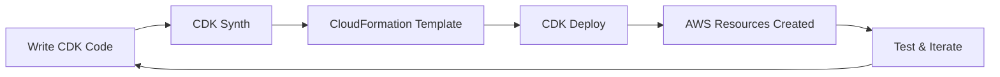

# AWS CDK Concepts & Learning Guide

## What is AWS CDK?

**AWS Cloud Development Kit (CDK)** is Infrastructure as Code (IaC) that lets you define AWS resources using familiar programming languages instead of YAML/JSON templates.

### CDK vs Other Tools

| Tool | Format | Learning Curve | Power |
|------|--------|---------------|-------|
| **CDK** | TypeScript/Python/Java | Medium | High |
| **CloudFormation** | YAML/JSON | Low | Medium |
| **Terraform** | HCL | Medium | High |
| **Serverless Framework** | YAML | Low | Medium |

**Why CDK for DevOps**: Real programming language means loops, conditions, functions, and IDE support with autocomplete.

---

## Core CDK Concepts

### 1. **Constructs** - Building Blocks

**What they are**: Reusable cloud components that represent AWS resources.

```typescript
// A construct is like a LEGO piece for AWS infrastructure
import * as lambda from 'aws-cdk-lib/aws-lambda';

// This construct represents a Lambda function
const myFunction = new lambda.Function(this, 'MyFunction', {
  runtime: lambda.Runtime.NODEJS_20_X,
  handler: 'index.handler',
  code: lambda.Code.fromAsset('dist')
});
```

**Think of constructs as:**
- **Low-level**: Direct 1:1 mapping to CloudFormation (e.g., `CfnFunction`)
- **High-level**: Opinionated best practices (e.g., `Function`)
- **Patterns**: Multiple resources working together (e.g., `ApplicationLoadBalancedFargateService`)

### 2. **Stacks** - Deployment Units

**What they are**: Groups of related resources that get deployed together.

```typescript
export class MyStack extends cdk.Stack {
  constructor(scope: Construct, id: string, props?: cdk.StackProps) {
    super(scope, id, props);
    
    // All resources in this stack get deployed together
    const lambda = new lambda.Function(/* ... */);
    const api = new apigateway.RestApi(/* ... */);
  }
}
```

**Think of stacks as:** Deployment boundaries - everything in one stack deploys/updates/deletes together.

### 3. **Apps** - Top-Level Container

**What they are**: Contains one or more stacks, represents your entire application.

```typescript
const app = new cdk.App();
new MyStack(app, 'MyStack');
new DatabaseStack(app, 'DatabaseStack');
```

**Hierarchy**: `App` → `Stack` → `Construct` → AWS Resources

---

## The Three CDK Terms You Asked About

### 1. "Import Necessary Constructs"

**What this means**: Bring in the CDK libraries for the AWS services you want to use.

```typescript
// These are the "constructs" - pre-built components for AWS services
import * as lambda from 'aws-cdk-lib/aws-lambda';        // For Lambda functions
import * as apigateway from 'aws-cdk-lib/aws-apigateway'; // For API Gateway
import * as dynamodb from 'aws-cdk-lib/aws-dynamodb';     // For DynamoDB
import { Construct } from 'constructs';                    // Base construct class
```

**Why needed**: CDK doesn't import everything by default - you only import what you use for smaller bundle sizes.

**Real-world analogy**: Like importing specific tools from a toolbox instead of carrying the entire toolbox.

### 2. "Create Lambda Function Pointing to Your Compiled TypeScript"

**What this means**: Tell CDK where your Lambda code lives and how to configure it.

```typescript
const helloLambda = new lambda.Function(this, 'HelloHandler', {
  runtime: lambda.Runtime.NODEJS_20_X,           // Which Node.js version
  code: lambda.Code.fromAsset('../../backend/dist'), // Where your compiled JS is
  handler: 'index.handler',                       // Which function to call
  timeout: cdk.Duration.seconds(30),            // How long it can run
  environment: {                                 // Environment variables
    NODE_ENV: 'development'
  }
});
```

**Breaking it down:**
- **`this`**: Add this Lambda to the current stack
- **`'HelloHandler'`**: Logical name for this Lambda (CDK will create unique AWS name)
- **`runtime`**: Tell AWS which Node.js version to use
- **`code.fromAsset()`**: Point to your compiled JavaScript files
- **`handler`**: `index.handler` means call `handler` function in `index.js`

**Real-world analogy**: Like telling a chef (AWS) which recipe book (your code) to use and which recipe (handler function) to make.

### 3. "Set Up API Gateway with Lambda Integration"

**What this means**: Create a REST API that forwards requests to your Lambda function.

```typescript
// Step 1: Create the API Gateway
const api = new apigateway.RestApi(this, 'MyApi', {
  restApiName: 'My Serverless API',
  description: 'API for my serverless app'
});

// Step 2: Create the integration (connection between API and Lambda)
const lambdaIntegration = new apigateway.LambdaIntegration(helloLambda);

// Step 3: Add routes (URL paths) that trigger the Lambda
api.root.addMethod('GET', lambdaIntegration);     // GET /
api.root.addResource('users').addMethod('POST', lambdaIntegration); // POST /users
```

**What happens:**
1. **User makes HTTP request** → `GET https://api.example.com/`
2. **API Gateway receives it** → Routes to Lambda function
3. **Lambda processes request** → Returns response
4. **API Gateway sends response** → Back to user

**Real-world analogy**: API Gateway is like a receptionist who routes phone calls (HTTP requests) to the right department (Lambda function).

---

## CDK Workflow for Your Project

### Development Cycle



### Your Specific Steps

1. **Write Infrastructure Code** (TypeScript)
   ```typescript
   // Define what you want: Lambda + API Gateway
   const lambda = new lambda.Function(/* config */);
   const api = new apigateway.RestApi(/* config */);
   api.root.addMethod('GET', new apigateway.LambdaIntegration(lambda));
   ```

2. **CDK Synthesizes** (Converts to CloudFormation)
   ```bash
   npx cdk synth  # Creates CloudFormation JSON
   ```

3. **CDK Deploys** (Creates AWS Resources)
   ```bash
   npx cdklocal deploy  # Creates actual Lambda & API Gateway in LocalStack
   ```

---

## Common CDK Patterns You'll Use

### Pattern 1: Lambda + API Gateway (Your Current Project)
```typescript
const lambda = new lambda.Function(this, 'Handler', { /* config */ });
const api = new apigateway.RestApi(this, 'Api', { /* config */ });
api.root.addMethod('GET', new apigateway.LambdaIntegration(lambda));
```

### Pattern 2: Lambda + DynamoDB (Next Phase)
```typescript
const table = new dynamodb.Table(this, 'UsersTable', {
  partitionKey: { name: 'userId', type: dynamodb.AttributeType.STRING }
});

const lambda = new lambda.Function(this, 'Handler', { /* config */ });
table.grantReadWriteData(lambda);  // Gives Lambda permission to access table
```

### Pattern 3: Multiple Environments
```typescript
// Different configurations for dev/prod
const isProd = props.stage === 'production';
const lambda = new lambda.Function(this, 'Handler', {
  timeout: isProd ? cdk.Duration.seconds(30) : cdk.Duration.seconds(60),
  memorySize: isProd ? 512 : 128
});
```

---

## CDK Best Practices for DevOps

### 1. **Organize by Logical Boundaries**
```
infrastructure/
├── lib/
│   ├── auth-stack.ts      # Cognito, IAM
│   ├── api-stack.ts       # API Gateway, Lambda
│   ├── database-stack.ts  # DynamoDB
│   └── monitoring-stack.ts # CloudWatch
```

### 2. **Use Environment Variables**
```typescript
const stage = process.env.STAGE || 'dev';
const lambda = new lambda.Function(this, `Handler-${stage}`, {
  functionName: `myapp-handler-${stage}`
});
```

### 3. **Output Important Values**
```typescript
new cdk.CfnOutput(this, 'ApiUrl', {
  value: api.url,
  description: 'API Gateway URL for testing'
});
```

### 4. **Tag Everything for Cost Tracking**
```typescript
cdk.Tags.of(this).add('Project', 'ServerlessAuth');
cdk.Tags.of(this).add('Environment', stage);
```

---

## Common CDK Gotchas

### 1. **Asset Path Issues**
```typescript
// ❌ Wrong - relative to CDK code
code: lambda.Code.fromAsset('./backend/dist')

// ✅ Correct - relative path properly calculated
code: lambda.Code.fromAsset(path.join(__dirname, '../../backend/dist'))
```

### 2. **Missing Permissions**
```typescript
// ❌ Lambda can't access DynamoDB
const table = new dynamodb.Table(/* ... */);
const lambda = new lambda.Function(/* ... */);

// ✅ Explicit permission grant
table.grantReadWriteData(lambda);
```

### 3. **Deployment Order**
```typescript
// CDK automatically handles dependencies
const lambda = new lambda.Function(/* ... */);
const api = new apigateway.RestApi(/* ... */);
api.root.addMethod('GET', new apigateway.LambdaIntegration(lambda));
// CDK knows to create Lambda first, then API Gateway
```

---

## Learning Path for CDK

### Beginner (Your Current Level)
- [x] Understand constructs, stacks, apps
- [x] Create Lambda function
- [x] Set up API Gateway integration
- [ ] Deploy to LocalStack
- [ ] Add environment variables

### Intermediate (Next Steps)
- [ ] Add DynamoDB table
- [ ] Implement IAM permissions
- [ ] Add Cognito user pool
- [ ] Create multiple environments
- [ ] Add CloudWatch monitoring

### Advanced (Future Goals)
- [ ] Custom constructs
- [ ] Cross-stack references
- [ ] CDK Pipelines (CI/CD)
- [ ] Testing CDK code
- [ ] CDK aspects for compliance

---

## Useful CDK Commands

```bash
# Basic commands
npx cdk init app --language typescript  # Create new CDK app
npx cdk synth                          # Generate CloudFormation
npx cdk deploy                         # Deploy to AWS
npx cdk destroy                        # Remove all resources
npx cdk diff                          # Show changes

# LocalStack commands (for local development)
npx cdklocal bootstrap                 # Setup CDK for LocalStack
npx cdklocal deploy                    # Deploy to LocalStack
npx cdklocal destroy                   # Remove from LocalStack

# Useful flags
npx cdk deploy --require-approval never # Don't ask for confirmation
npx cdk deploy --hotswap               # Fast deployment for dev
npx cdk deploy --profile myprofile     # Use specific AWS profile
```

---

## Next Steps When You Return

1. **Install CDK dependencies** in your infrastructure project
2. **Configure your CDK stack** with the Lambda and API Gateway constructs
3. **Test the deployment** to LocalStack
4. **Understand the generated CloudFormation** to see what CDK created
5. **Add more functionality** like DynamoDB and error handling

Remember: CDK is just a tool that generates CloudFormation - understanding what AWS resources you're creating is more important than memorizing CDK syntax!